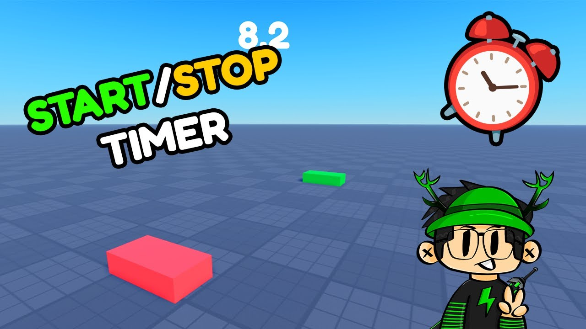

# Roblox-Child-Controller 
### NOTE: ONLY FOR Windows PC's, not for Virtual Machines and other OS or any Virtual Machine!


## Overview

This Python script helps parents control Roblox usage on a Windows 11 PC by allowing temporary access to Roblox websites and the Roblox app, and then blocking access after a set time or upon manual interruption.

---

## How It Works

1. **Temporary Allowance**  
   When you start the script, it *unblocks* Roblox domains and allows the Roblox app to run freely for a specified time (you choose the duration in hours).

2. **Automatic Blocking and Cleanup**  
   After the time expires — or if you press `Ctrl+C` — the script:
   - Blocks Roblox website domains by editing the system’s `hosts` file.
   - Renames Roblox executables to prevent the app from launching.
   - Blocks Roblox through the Windows Firewall.
   - Attempts to uninstall Roblox from the computer.
   - Cleans up Roblox data from user folders.

---

## Requirements

- Windows 11 (or compatible Windows versions)
- Python 3.x installed
- Run the script **as Administrator** (Right-click the script or terminal → Run as Administrator)
- `pywin32` package installed (`pip install pywin32`)

---

## How to Use

How to use
### Run as Administrator!

- To block Roblox after some allowed time, run:

```
python roblox-control.py
```

- Pressing Ctrl+C during the waiting period will run the uninstall/cleanup before exiting and leave the domain blocked.
